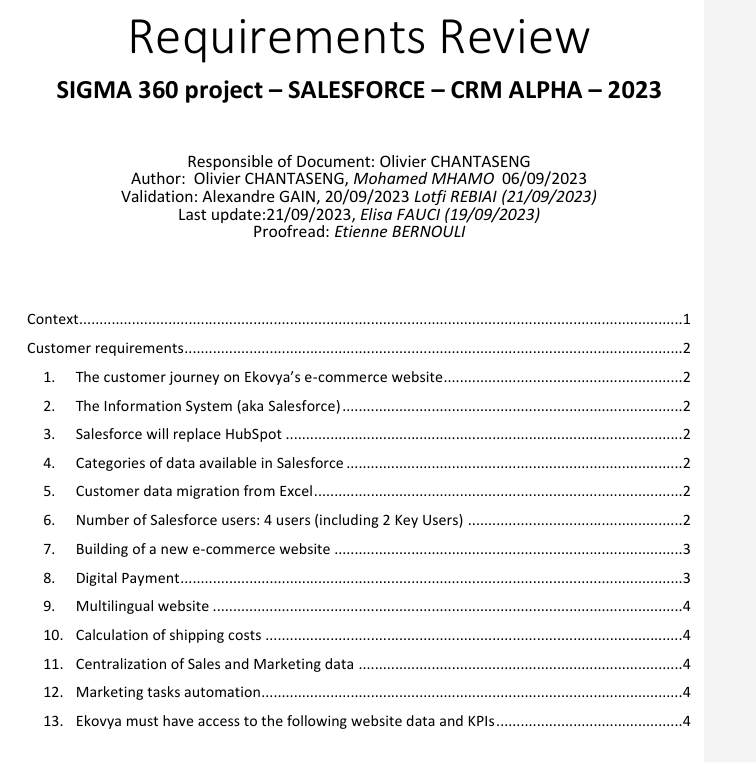
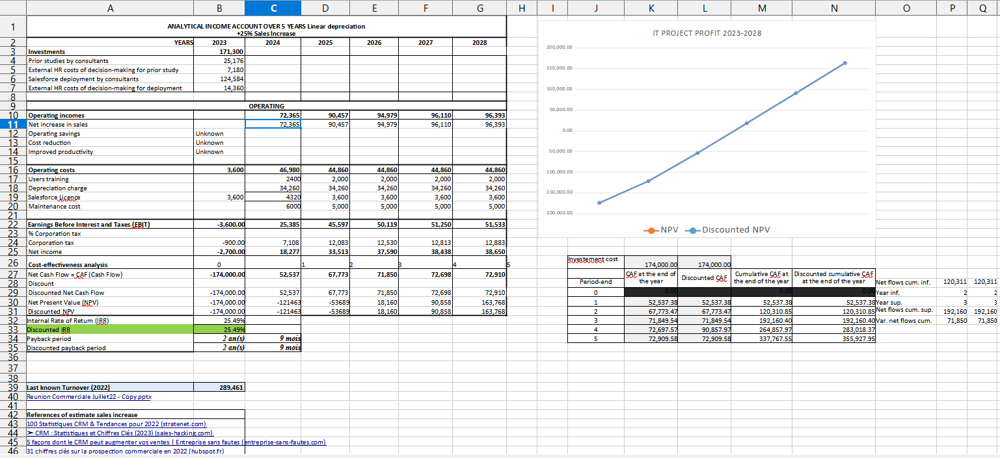
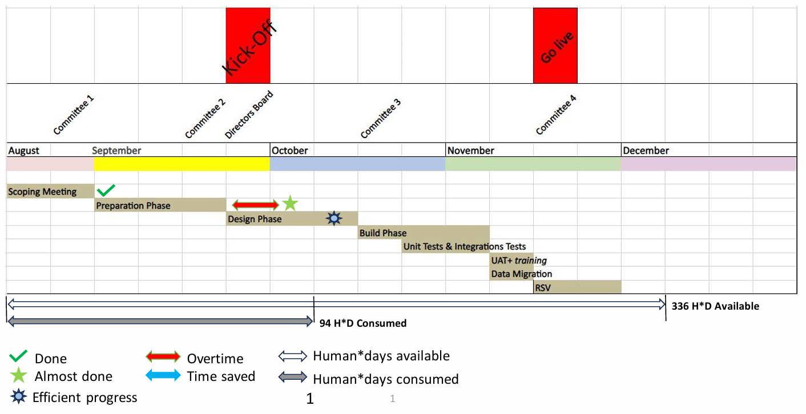
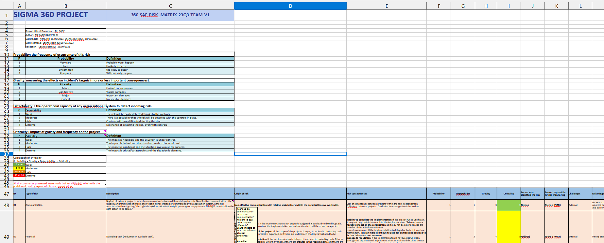
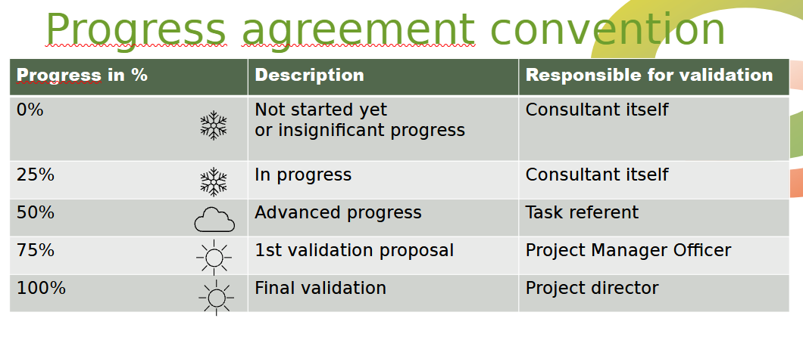
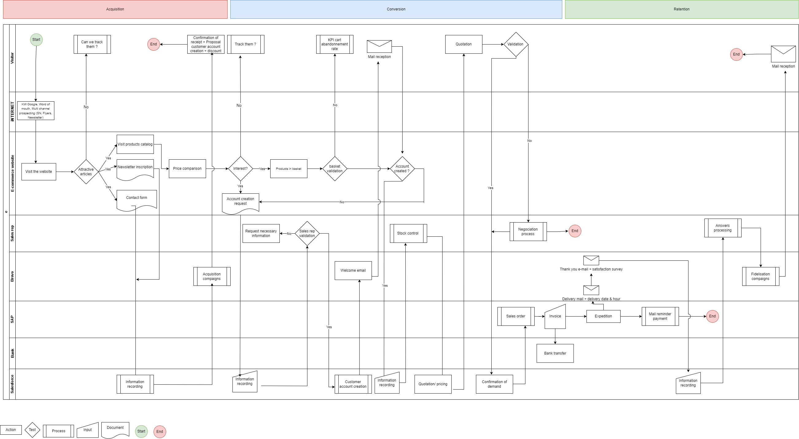

<h1>Project Sigma360</h1>

The Salesforce project Sigma360 is a Proof Of Concept (POC) developed inside the company Edumotiv which owns the brand Ekovya that deals office furnitures with an eco-responsible marketing position. 
Its end goal is to automate the communication with customers and facilitate the retrieval of data for better strategic decision-making.

As a Project Manager, I was in charge of plannification, cost control, and rigourous documentation. I prepared an official presentation for the project update report to be delivered every month to the board of directors, using PowerPoint, Figma, and advanced Excel sheets.

We used OpenProject to track time and cost of each task and make sure we were within the timeframe and budget.

I also participated in the configuration of the Salesforce platform, the design of the website and the automation processes connecting both.

<h2>Project organigram</h2>

<h2>Information System Architecture</h2>
<strong>The ultimate "Nice to Have" architecture:</strong>

<strong>The primordial "Must Have" architecture:</strong>

<h2>Project Main Requirements</h2>

<h2>Return on Investment calculation</h2>

<h2>Planning and Cost Control</h2>

<h2>Risk Matrix</h2>

<h2>Progress Agreement Convention</h2>

<h2>Naming Convention</h2>

<h2>Business Processes</h2>
<strong>Customer Journey</strong>

<strong>Lead to Opportunity</strong>

<strong>Opportunity to Customer</strong>

<strong>Sales to Service</strong>

<strong>Mailing Campaign</strong>

<h2>Website Mockup</h2>
The website mockup has been designed with Figma, a Saas graphic design software allowing multiple users to work together at the same time, which is useful for collaborative design tasks.
<strong>Website Architecture</strong>

<strong>Product Page Architecture</strong>
